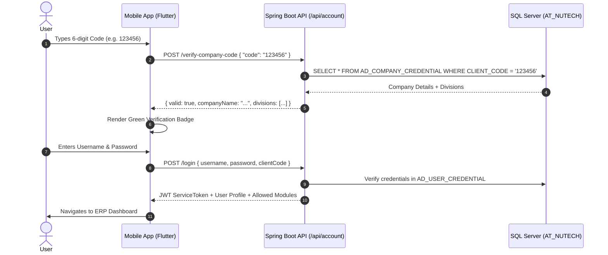

# NUTECH ERP - Complete System Architecture & Operational Documentation

Welcome to the central technical and operational documentation for the **NUTECH ERP Platform**, covering the Spring Boot Backend, React Web ERP, Flutter Mobile/Web Application, and Microsoft SQL Server Database.

---

## Table of Contents
1. [System Architecture & Core Stack](#1-system-architecture--core-stack)
2. [Database Operations & Dump Restoration](#2-database-operations--dump-restoration)
3. [Dynamic 6-Digit Company Authentication](#3-dynamic-6-digit-company-authentication)
4. [QMS Meeting & Audit Attendance System](#4-qms-meeting--audit-attendance-system)
5. [Visitor Gate Pass System & Scoping](#5-visitor-gate-pass-system--scoping)
6. [Mobile App Runtime Configuration (Zero Hardcoding)](#6-mobile-app-runtime-configuration-zero-hardcoding)
7. [Building & Deploying Applications](#7-building--deploying-applications)
8. [Standard Operating Procedures (SOP Manuals)](#8-standard-operating-procedures-sop-manuals)

---

## 1. System Architecture & Core Stack

```mermaid
graph TD
    subgraph "Clients"
        WEB["React Web ERP<br/>(Port 3001)"]
        FLUTTER_WEB["Flutter Web Portal<br/>(Port 3002)"]
        APK["Android Release APK<br/>(Physical Phones & Emulators)"]
    end

    subgraph "API & Business Logic"
        API["Spring Boot REST API<br/>(Port 8081)<br/>-DDB_NAME=AT_NUTECH"]
    end

    subgraph "Database Layer"
        MSSQL[("Microsoft SQL Server 2022<br/>Database: AT_NUTECH<br/>Port 1433")]
    end

    WEB -->|JWT Bearer + Headers| API
    FLUTTER_WEB -->|JWT Bearer + Dynamic URL| API
    APK -->|REST API (Dio + Interceptors)| API
    API -->|HikariCP Connection Pool| MSSQL
```

### Core Technologies
* **Spring Boot REST API (`8081`)**: Java 21, Spring Boot 3.2.5, JPA / Hibernate, Dynamic SQL Migrations (`SqlMigrationRunner`).
* **React Web ERP (`3001`)**: React 18, Material-UI, Zustand, TanStack Query.
* **Flutter Mobile & Web (`3002`)**: Flutter 3.35+, Clean Architecture, BLoC (`flutter_bloc`), GetIt, Dio.
* **Database (`1433`)**: Microsoft SQL Server (`AT_NUTECH`), UTF-8 Unicode (`NVARCHAR`), Idempotent Migrations.

---

## 2. Database Operations & Dump Restoration

### A. Database Details
* **Primary Target Database**: `AT_NUTECH`
* **Default Port**: `1433`
* **Zero Mock Policy**: All tables contain production-grade real master and transaction data.

### B. Complete Backup File
* **Filename**: `AT_NUTECH_FULL_DUMP.bak` (Size: `141 MB`)
* **Location**: Root directory: `/Users/eash/Desktop/ERP 1.11.56 AM/AT_NUTECH_FULL_DUMP.bak`

### C. Restoring the Backup on a New SQL Server Instance
To restore the complete database on any SQL Server:
```sql
RESTORE DATABASE [AT_NUTECH]
FROM DISK = '/path/to/AT_NUTECH_FULL_DUMP.bak'
WITH MOVE 'NUTECH_LIVE' TO '/var/opt/mssql/data/AT_NUTECH.mdf',
     MOVE 'NUTECH_LIVE_log' TO '/var/opt/mssql/data/AT_NUTECH_log.ldf',
     REPLACE, STATS = 10;
```

---

## 3. Dynamic 6-Digit Company Authentication

The login flow operates **100% dynamically** with zero hardcoded company codes, names, or credentials.



### Key Highlights:
1. **6-Box Segmented PIN Widget (`SixDigitCodeInput`)**: Uses responsive `Expanded` flex sizing to dynamically fit any mobile screen width without pixel overflow.
2. **Dynamic Verification**: Calls `POST /api/account/verify-company-code` immediately upon completing the code.
3. **Dynamic Tenant & Division Binding**: Automatically extracts the company's active divisions from `AD_DIVISION` and binds them to the session.

---

## 4. QMS Meeting & Audit Attendance System

### Enterprise 10-Minute Rules:

```
                      Scheduled Start Time
                               │
       ◄── 10 min ─────────────┼───────────── 10 min ─────────────►
──────┬────────────────────────┼────────────────────────┬─────────────►
      │ Early Check-in Active   │ On-Time Grace Window   │ Delayed Window
      │ (Lock Released)         │ Marked: PRESENT        │ Marked: LATE
```

1. **Early Window (10 Minutes Prior)**:
   * The check-in button unlocks exactly 10 minutes before the scheduled meeting/audit time.
2. **On-Time Grace Window (Start Time to +10 Minutes)**:
   * Any check-in during this 10-minute window stamps attendance status as **`PRESENT`**.
3. **Delay Classification (> 10 Minutes Late)**:
   * Checking in beyond the 10-minute grace window automatically stamps the status as **`LATE`** dynamically fetched from `AD_STATUS_MASTER`.

---

## 5. Visitor Gate Pass System & Scoping

### A. Permission Scopes (`taskScope`):
* **`Mine`**: Shows passes for visitors scheduled to meet the current logged-in employee.
* **`Team`**: Shows passes for visitors meeting any direct reportees under the user's management hierarchy.
* **`Company`**: Displays all passes across the company. Automatically defaults to `Company` for Security Guards, Receptionists, and Administrators.

### B. Dynamic Tab Filters & Counter Chips:
* **`ALL PASSES (50)`**: Total passes registered in the selected scope.
* **`INSIDE PLANT (0)`**: Real-time count of visitors currently inside the premises.
* **`CHECKED OUT (50)`**: Historical list of completed visitor check-outs.

---

## 6. Mobile App Runtime Configuration (Zero Hardcoding)

* **Server URL Dialog**: Accessible directly on the login screen via **"Configure Server URL & Network"**.
* **Supported Targets**:
  * Local Developer Machine / Emulator: `http://10.0.2.2:8081` or `http://localhost:8081`
  * Local Factory / Plant Wi-Fi: `http://192.168.x.x:8081`
  * Production Domain: `https://erp.nutechwindparts.com`
* **Real-Time Injection**: Saving updates `DioClient.dio.options.baseUrl` on-the-fly and persists in encrypted storage (`SecureStorageService`).

---

## 7. Building & Deploying Applications

### A. Running Services Locally

#### 1. Spring Boot Backend (Port 8081)
```bash
cd autonoma-backend
mvn spring-boot:run \
  -DDB_NAME=AT_NUTECH \
  -Dspring.datasource.databasename=AT_NUTECH \
  -DDB_USERNAME=sa \
  -DDB_PASSWORD=nutech@2026
```

#### 2. React Web ERP (Port 3001)
```bash
cd autonoma-frontend
npm start
```

#### 3. Flutter Web Portal (Port 3002)
```bash
cd autonoma_flutter
flutter run -d web-server --web-port 3002 --web-hostname localhost
```

#### 4. Running on Android Emulator / Physical Device
```bash
cd autonoma_flutter
flutter run -d emulator-5554
```

### B. Building Release APK
```bash
cd autonoma_flutter
flutter clean
flutter pub get
flutter build apk --release
```
* **Release Output File**: `autonoma_flutter/NUTECH_ERP_v1.0.apk` (`67 MB`)
* **Top-Level Root Copy**: `/Users/eash/Desktop/ERP 1.11.56 AM/NUTECH_ERP_v1.0.apk`

---

## 8. Standard Operating Procedures (SOP Manuals)

All modules are accompanied by standardized SOP manuals in the frontend registry:
* **Meeting Attendance Manual**: `autonoma-frontend/src/ui-component/bos/manuals/MeetingAttendanceManual.js`
* **Audit Attendance Manual**: `autonoma-frontend/src/ui-component/bos/manuals/AuditAttendanceManual.js`
* **Visitor Gate Pass Manual**: `autonoma-frontend/src/ui-component/bos/manuals/VisitorGatePassManual.js`
* **Central Manual Index**: `autonoma-frontend/src/ui-component/bos/PageUserManuals.js`
